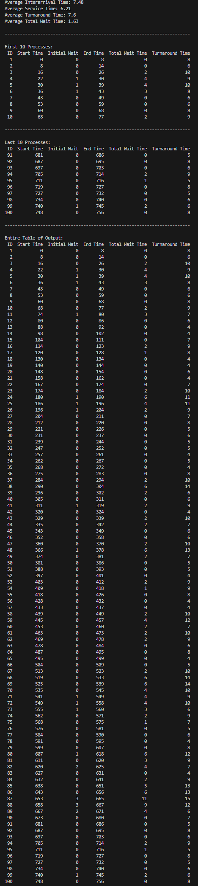

# Round Robin CPU Scheduler
A simulation of a round robin scheduling algorithm with configurable context switching and quantum time.

# What Does it Do?
Randomly generates 100 processes with unique arrival times and service times. The first process will arrrive at the start, then each process will arrive 5-10 units after the previous process. Each process will require 4-8 units of service time. Calculates metrics such as waiting time, turnaround time (total time needed to complete the process), and average interarrival, service, turnaround, and total wait times for all 100 processes

# Features:
- configurable time quantum and context switch time
- handles processes with different arrival times and service times
- Calculates averages for interarrival, service, turnaround, and total wait times
- Outputs execution table so order can be visually seen

# Tech Stack
- Just python, relatively simple

# File Structure
- Process.py: Creates process data structure to hold data
- RandomProcessHelper.py: Helper function for main
- main.py Executes program and contains scheduling logic

# How to Run:
Install needed packages using pip or conda. These are listed in the requirements.txt file. Then run main as a python script and it should work!

# Example output:

